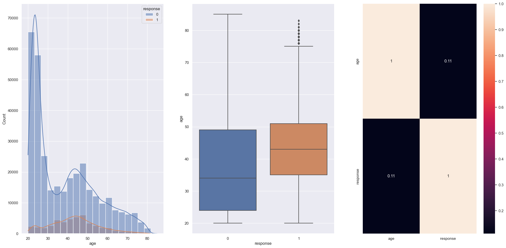
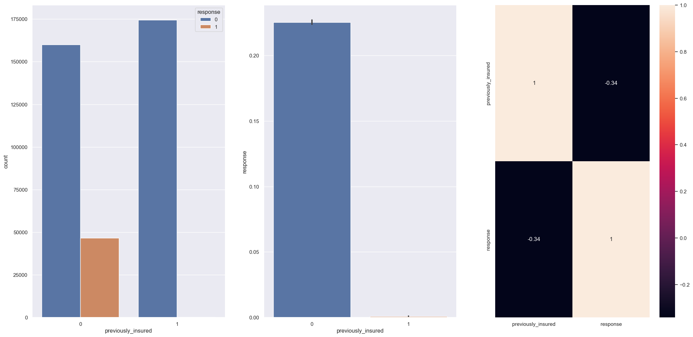
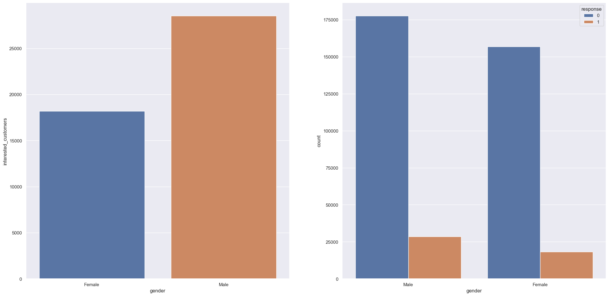

# Health Insurance Cross Sell

  

## Overview
This is a Learning to Rank (LTR) project in which the objective is to classify and rank clients interested in purchasing vehicle insurance. The company SafeHarbor Insurance is a fictitious insurance company made up by us, in order to provide a business context for our problem. The data have been acquired in the challenge [Health Insurance Cross Sell Prediction](https://www.kaggle.com/datasets/anmolkumar/health-insurance-cross-sell-prediction) from Kaggle, We perform an exploratory data analysis, train different classification Machine Learning models, evaluate the metrics, and test their results.
#### This project was made by Pablo Miranda

# 1. Business Problem
## 1.1. Business Context
SafeHarbor Insurance is a big company that offers health insurance for an annual fee to insure its clients on a yearly basis. Their product team is developing the resources to offer vehicle insurance to SafeHarbor clients. A survey has already been conducted, in which 381,109 insured clients indicated their willingness to purchase this new product. However, there is a new portion of clients (127,037 clients) who have subsequently purchased SafeHarbor health insurance and it is not known if they are willing to also purchase the new vehicle insurance.
The product team needs to know how viable is to sell this vehicle insurance for the new customers, because the sales team also has a challenge: the offer of the new product will be made directly by phone calls, and they are limited to a total of 20,000 phone calls. We must therefore train a Machine Learning model that ranks and sorts the new customers according to their propensity to buy the product, so that they can be prioritized by the sales team.
## 1.2. Objectives
- Which variables are more relevant to an understanding of the conditions under which customers are interested in purchasing vehicle insurance?
- What percentage of customers interested in purchasing vehicle insurance can the sales team contact by making 20,000 phone calls?
- If the sales team's limit of phone calls is increased to 40,000, what percentage of customers interested in purchasing vehicle insurance will be contacted by the sales team?
- How many phone calls does it take for the sales team to contact 80% of the customers interested in purchasing vehicle insurance?
# 2. Business Assumptions
## 2.1. General 
The context in Kaggle brings up values in Rupees, a common term for the currency of different Southeast Asian countries. Assuming we are talking about Indian Rupees, we can perform a direct conversion of these values to American Dollars, however, the resulting value may not accurately represent the reality of businesses outside of India. This, of course, will not affect the data exploration or the construction of the Machine Learning models. We are also assuming that the sales team has knowledge in handling the functionalities of Google Sheets.
## 2.2. Variables
- id: Unique ID for the customer.
- Gender: Gender of the customer.
- Age: Age of the customer.
- Driving_License: 	0 = Customer does not have DL, 1 = Customer already has DL.
- Region_Code: Unique code for the region of the customer.
- Previously_Insured: 1 = Customer already has Vehicle Insurance, 0 = Customer doesn't have Vehicle Insurance.
- Vehicle_Age: Age of the Vehicle.
- Vehicle_Damage: 1 = Customer got his/her vehicle damaged in the past, 0 = Customer didn't get his/her vehicle damaged in the past.
- Annual_Premium: The amount customer needs to pay as premium in the year.
- PolicySalesChannel: Anonymized Code for the channel of outreaching to the customer ie. Different Agents, Over Mail, Over Phone, In Person, etc.
- Vintage: Number of Days, Customer has been associated with the company.
- Response: 1 = Customer is interested, 0 = Customer is not interested.

For the description of these variables, we consulted the link below:
https://www.kaggle.com/datasets/anmolkumar/health-insurance-cross-sell-prediction
# 3. Solution Planning
## 3.1. Final Product
A Google Sheets file, sorting all customers by their propensity to buy the new product according to our Machine Learning Model, and that can be easily handed by the sales team.
## 3.2. Tools Used
- Python 3.10.10;
- VS Code;
- Jupyter Notebook;
- PostgreSQL;
- Git and Github;
- Render Cloud;
- Flask;
- Google Sheets Apps Script.
# 4. Solution Strategy

My strategy to solve this challenge was:

**Step 01. Data Description:**

Here we performed the first exploration of the data. Although we will not need to split the data between test, train, and validation sets, as Kaggle has already done this for us, we will still need to perform the following tasks:
- Examine the dataset variables;
- Rename the columns to lower case;
- Check the data types;
- Check for missing data (and determine the best strategy to deal with missing data);
- Explore descriptive statistics.

**Step 02. Feature Engineering:**

This step involves not only exploring the relationships between features, but also creating new features that may better serve the training of our ML models. We will perform the following tasks:
- Create a mindmap to question the relationships between the features;
- Develop new features.

**Step 03. Data Filtering:**

No data filtering was necessary for this project.

**Step 04. Exploratory Data Analysis:**

In this step, we will perform univariate, bivariate, and multivariate analyses of the dataset features to generate business insights and validate previously raised hypotheses. The insights generated here will help us select which features may be relevant for the ML models. We will perform the following tasks:
- Perform univariate analysis of each feature;
- Perform bivariate analysis to validate hypotheses;
- Perform multivariate analysis with the help of a heatmap;
- Evaluate hypothesis validations.

**Step 05. Data Preparation:**

Here, the scikit-learn library was used for data preprocessing.
- Standardize the 'annual_premium' feature using the StandardScaler() method;
- Rescale the 'age' and 'vintage' features using MinMaxScaler() since there are no outliers;
- Encode the features using the following methods: one-hot encoding for 'vehicle_age', target encoding for 'gender' and 'region_code', and frequency encoding for 'policy_sales_channel'.

**Step 06. Feature Selection:**

We will use the Boruta algorithm to select features. We will perform the following tasks:
- Use the ExtraTreesClassifier model with the Boruta algorithm to select features;
- Consider feature importance using the 'feature_importances_' attribute from ExtraTreesClassifier. Then, plot a graph to display the best ranking features to facilitate feature selection.

**Step 07. Machine Learning Modelling:**

Three classification models (KNeighborsClassifier, LogisticRegression, and RandomForestClassifier) were trained, generating probability predictions, calculating propensity scores, and sorting customers by score. Then, precision and recall values were calculated for the top 50 customers for each model.
- Using the 'cgc_lc' function, cumulative gain and lift curves were plotted for a set of provided models, allowing for a visual comparison of results;
- The 'cross_validation' function was used to perform cross-validation for the provided models and return the means and standard deviations of precision and recall for each model;
- The 'precision_at_k' and 'recall_at_k' functions were used to calculate precision and recall for the top k customers classified by the model.

**Step 08. Hyperparameter Fine Tunning:**

We performed a randomized search with cross-validation to optimize the hyperparameters of a logistic regression model and maximize the f1-score. Then, we will train the model on a dataset and evaluate it on a validation set.
- The tuned model was then applied to a test set to predict outcomes;
- Precision and recall were calculated at the top 50 clients for the model;
- The performance of the tuned model was compared to the performance of the original logistic regression model using cross-validation;
- Two models were plotted on the accumulative gain and lift curves to compare their performance.

**Step 09. Convert Model Performance to Business Values:**
We answered the 4 questions proposed in the challenge according to the final model. The details of the answers are further down, in the Business Results section.

**Step 10. Deploy Model to Production:**
The deployment was done on Render cloud. We prepared a Python script that started and executed the entire pipeline, which along with the entire repository, was uploaded to GitHub. Render made contact between the online repository and a Google Sheets spreadsheet with the score for each of the customers. In turn, in Google Sheets, a script was created that automated the reception of information and the score provided by the model.
- The repository was committed to GitHub;
- A Python script within the repository on GitHub is triggered by Render Cloud;
- A script within Google Sheets receives information from Render Cloud and automates the customer scores.

# 5. Top 3 Data Insights

**Hypothesis 01:** younger customers are more likely to be interested in purchasing vehicle insurance than older customers.

**False**: most of the clients interested in purchasing insurance are around 35 to 50 years old.

  

**Hypothesis 02:** customers who have previously purchased SafeHarbor health insurance are more likely to be interested in purchasing vehicle insurance than those who have not.

**False**: customers which doesn't purchased SafeHarbor health insurance previously are the more inclined to buy vehicle insurance.

  

**Hypothesis 03:** men are more likely to purchase insurance than women.

**True**: Men are more willing to purchase vehicle insurance with a difference of 22.14% compared to women.

  

# 6. Machine Learning Model Applied
The model applied to this challenge was Logistic Regression. Using Logistic Regression in Learning to Rank has several advantages, such as simplicity, interpretability, and fast training speed. It can handle a large number of features, including categorical ones, and can perform well in cases where the relationships between features and rankings are linear. These advantages were particularly relevant when deploying our model to the cloud, where availability was prioritized over achieving the best possible metric.

# 7. Machine Learning Model Performance

| Model_Name         | Precision@K Mean  | Precision@K STD   | Recall@K Mean | Recall@K STD |
| ----------------- | ----------------- | ----------------- | ------------- | ------------ |
| LogisticRegression | 0.273200          | 0.001100          | 0.734700      | 0.003000     |
| LogisticRegression | 0.271000          | 0.002400          | 0.728800      | 0.006400     |

# 8. Business Results
These are our initial questions together with the answers from our model:
1. Which variables are more relevant to an understanding of the conditions under which customers are interested in purchasing vehicle insurance?
- vintage; 
- annual_premium;
- age;
- vehicle_damage;
- previously_insured.

2. What percentage of customers interested in purchasing vehicle insurance can the sales team reach by making 20,000 phone calls?
- With 20.000 calls sales team will be contact **58% of customers interested**.

3. If the sales team's limit of phone calls is increased to 40,000, what percentage of customers interested in purchasing vehicle insurance will be contacted by the sales team?
- With 40.000 calls sales team will be contact **99% of customers interested**.

4. How many phone calls does it take for the sales team to contact 80% of the customers interested in purchasing vehicle insurance?
- With 28.400 calls sales team will be contact **80% of customers interested**.

# 9. Conclusions

# 10. Lessons Learned

# 11. Next Steps to Improve
